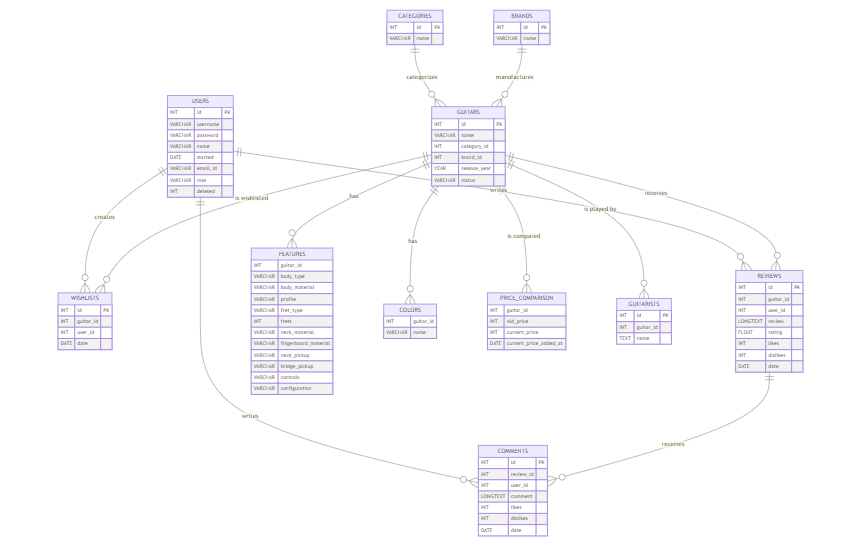

# Design Document

By Aditi Munde

Video overview: <URL HERE>

## Scope

This database is built for a website where guitar players or those who are looking to buy a guitar can write and read reviews of different guitars. It contains information about the guitars, the users of the website, the reviews, ratings and comments by the users.

The scope of the database is:
1. Users : includes user credentials
2. Categories : contains different types of guitars
3. Brands : includes all guitar brands
4. Guitars : basic information about the guitar is kept in this table
5. Colors : all colors in which a guitar is available are listed here
6. Guitarists : lists the guitars used by some musicians
7. Features : lists detailed specs of a guitar
8. reviews : user reviews of a guitar are stored in this table
9. comments : comments made on a review are stored in this table
11. wishlists : this table stores all the guitars that a user would bookmark
12. price comparison : this table stores the old and current price of a particular guitar

Guitar shopping , repairs and promotions are outside the scope of this database.
## Functional Requirements

In this section you should answer the following questions:

A user should be able to find new guitars and guitar brands. Users can look through the specs behind these guitars and write reviews for the ones they have used. The goal is to store discussions among guitar players about certain aspects such as features, prices and the styles of their favorite guitarists.

* What's beyond the scope of what a user should be able to do with your database?
A user cannot buy any guitars that they are looking at, but they can certainly find what guitar they should purchase, or what guitar suits the style of music they like.

## Representation

### Entities

Following are the entities of this database:
1. Users
    1. id : a number to uniquly identify a user with INT data type. It is the primary key of this table
    2. username : a unique name of the user so that they can be anonymous if they want to. username should be unique. It need not be too long hence the VARCHAR(25) datatype
    3. password :  secret code for user authentication. It can include characters, numbers and symbols with datatype VARCHAR(25)
    4. name : the actual name of the user with datatype VARCHAR(25)
    5. start : the date at which the user has registered set default to the current date
    6. email-id : email-id cannot be null and must be a unique value
    7. role : user maybe the user or the admin of the database
    8. deleted : an integer value that is either 0 or 1 where 1 corresponds to true if the account is deleted and vice versa. should be between 0 and 1. set default to 0 that is "not deleted" and cannot be null

2. Categories
    1. id : a number to uniquely identify a catogory of guitars with the INT datatype. It is the primary key of this table.
    2. name : name of the category with datatype VARCHAR(100), must be unique and not null

3. Brands
    1. id : a number to uniquely identu=ify a brand of a guitar with the INT datatype. It is the primary key of this table.
    2. name : name of the brand with datatype VARCHAR(100), must be unique and not null

4. Guitars
    1. id: a number to uniquely identify a guitar with the INT datatype. It is the primary key of the table
    2. category_id : stores the id of the category to which the guitar belongs. It is a foreign key that references id column of the categories table.
    3. brand_id : stores the id of the brand of which the guitar is. It is a foreign key that referencnes the id column of the brands table
    4. release year : maybe be null, has datatype YEAR
    5. status : stores the status of the guitar - AVAILABLE or DISCONTINUED. Status cannot be null

5. Guitarists
    1. id : a number to uniquely identify a popular guitarist with the INT datatype. It is the primary key of this table.
    2. guitar_id : the id of the guitar that is played by the guitarist
    3. name : the name of the guitarist. Name cannot be null

6. Colors
    1. id : a number to uniquely identify a color with the INT datatype. It is the primary key of this table.
    2. name : Name cannot be null

7. Features
    1. guitar_id :  stores the id of the guitar. It is a foreign key that references the id column of the guitars table
    2. body_type : type maybe hollow or les paul type etc..
    3. body_material : the wood material used in the body
    4. profile : neck profile maybe C neck profile, vintage etc
    5. fret_type : fret_type maybe jumbo, medium jumbo etc
    6. frets : the number of frets in the guitar. It has check constraint as frets maybe between 14 and 46
    7. neck_material : the wood material used in the neck
    8. fingerboard_material : the wood material used on the fingerboard
    9. neck_pickup
    10. bridge_pickup
    11. controls : the volume knobs or tone knobs or pickup selector switch
    12. configuration : humbucker and single coil pickup configuration

8. Reviews
    1. id : a number to uniquely identify a review with the INT datatype.It is a primary key.
    2. guitar_id : the id of the guitar whose review is being discussed. It is a foreign key that references id column of the guitar table
    3. user_id : the id of the user who is writing the review. It is a foreign key that references id column of the users table.
    4. review : guitar review of the user, with data type LONGTEXT. This field cannot be null.
    5. likes : upvotes or likes made by other users with data type INT. This value must be positive.
    6. dislikes : downvotes or dislikes made by other users with data type INT. This value must be positive.
    7. date : the date on which the review was submitted.

9. Comments
    1. id : a number to uniquely identify a comment with the INT data type. It is a primary key.
    2. review_id : the id of the review whose comments are in this table. It is a foreign key that references the id column of the reviews table.
    3. user_id : the id of the user who is writing the comment. It is a foreign key that references the id column of the users table.
    4. comment : comment made by the user with data type LONGTEXT. This field cannot be null.
    6. likes : upvotes or likes made by other users with data type INT. This value must be positive.
    7. dislikes : downvotes or dislikes by other users with data type INT. This value must be positive.
    8. date : the date on which the comment was submitted.

10. Price comparison
    1. guitar_id : the id of the guitar whose price is being  compared. This is a foreign key that references the id column of the guitar table.
    2. old_price : the old price of the guitar with data type INT. this value cannot be null.
    3. current_price : the current price of the guitar with data type INT. this value cannot be null.
    4. current_price_added_at : the date at which the current price was updated

11. Wishlists
    1. id : a number to uniquely identify a wishlist of guitars.This is the primary key of this table.
    2. guitar_id : the id of the guitar being wishlisted. This is a foreign key that references the id column of the guitar table.
    3. user_id : the id of the user to whom this wishlist belongs. This is a foreign key that references the id column of the user id
    4. date : the date on which a guitar was added to the wishlist

### Relationships
The entity relationship diagram for this database is as follows:

1. One user can create one or many wishlists.
2. One user can write one or many reviews.
3. One user can write only one review on a guitar.
4. One user can write one or many comments.
5. One category categorizes one or many guitars.
6. One brand manufactures one or many guitars.
7. One guitar is manufactured by one and only one brand.
8. One guitar belongs to one and only one category.
9. One wishlist can have one or more than one guitars.
10. One guitar can have one or many features.
11. One guitar can have one or many colors.
12. One color belongs to one or many guitars
13. One guitar can have more than one price comparisons.
14. One guitar is played by one or more than one guitarists.
15. One guitarist plays more than one guitars.
16. One review can have one or many comments.

## Optimizations

Following are the indexes in this database :
1. find_pass : This index speeds up the process of finding passwords on the users table.
2. find_features : This index helps quickly navigate to the features of a guitar.

## Triggers
The database monitors the activity of the users adding, updating or deleting data. If it is found that a deleted user is trying to modify the data, a trigger is fired raising an error message. 
1. deleted_user_inserts_reviews
2. deleted_user_inserts_comments
3. deleted_user_inserts_wishlists
4. deleted_user_updates_reviews
5. deleted_user_updates_comments
6. deleted_user_updates_wishlists
7.deleted_user_deleted_from_reviews
8.deleted_user_deletes_from_comments
9.deleted_user_deletes_from_wishlists
10. check_old_and_new_price : this trigger is fired if the old and new prices are same in the price_comparison table
## Stored procedure
This trigger will require the functionality to first check whether any insert or update or delete operation within the database is done by a user whose account is deleted. Triggers for all such operations on all valid tables will require this functionality. Hence the task is employed to a stored procedure called check_user_status. Now this procedure can be called within the triggers.

## Limitations

1. The design implementation lacks indexes for optimization of reviews and comments, since these have the LONGTEXT datatype.
2. This database gives us the count of likes and dislikes on a review or a comment but does not represent the users who have liked or disliked.

